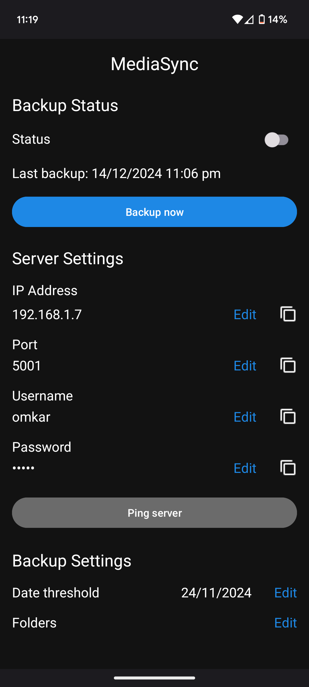

# MediaSync

### Effortless Media Backup with MediaHaven

  

 

**MediaSync** is an Android application designed to seamlessly back up your media files to **MediaHaven**. It provides a user-friendly interface for secure and reliable backups.  

> **Note**: The MediaHaven API Server must be up and running to use this application.

 

## Installation 🚀

To get started, navigate to the [Releases](https://github.com/omkar-sutar/MediaSync/releases) section of this repository. Download and install the APK of the [latest](https://github.com/omkar-sutar/MediaSync/releases/tag/v1.0.0) release on your Android device.
Make sure to grant the requested permissions on the first launch of the app.

 

## Configuration ⚙️

After installation, configure the app with the following steps:  
1. Set the values of the following parameters by clicking the `Edit` button beside the value. 
   - **Server IP Address**  
   - **Server Port**  
   - **Username**  
   - **Password**  

2. Test your configuration by clicking the `Ping` button. The app will validate the connection and login credentials.  

### User Preferences (Optional)

Customize your backup behavior with the following options:  
- **Date Threshold**: Skip media files created or modified before a specific date. This is useful for excluding older media that has already been backed up elsewhere.  
- **Folders**: Specify a comma-separated list of folders to include in backups. By default, the app includes `DCIM/Camera`. Use `%` for wildcard path matching.  
  - **Example**: `%DCIM/Camera%, %Pictures/Screenshots%`  

 

## Planned IAs 📃️

Action items planned for future releases:  
- **Automatic Backup**: Automatically back up media files without manual intervention.  
